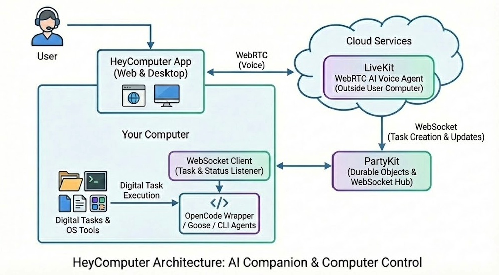

HeyComputer 🎙️💻
Talk to your computer. It listens, thinks, and gets things done. A real-time voice interface for local AI agents, powered by WebRTC and Durable Objects.

📖 Overview
HeyComputer is an open-source framework that turns any computer into a voice-controlled agent. It bridges the gap between ultra-low latency Voice AI (in the cloud) and secure Task Execution (on your local machine).

Unlike traditional assistants that just "search the web," HeyComputer uses a local WebSocket connection to drive agents like OpenCode, Goose, or Droid to perform actual work on your filesystem, terminal, and browser.

🏗️ Architecture
The system operates like a multiplayer game where the "User" and the "Computer" are synchronized players.

The Brain (Voice AI): Running on LiveKit.

Ears: Deepgram (STT).

Mind: Inception Mercury (Diffusion LLM) for speed.

Mouth: Cartesia (TTS) for realism.

The Nervous System (Relay): PartyKit (Durable Objects).

Acts as a secure, stateful WebSocket relay.

No port forwarding or public tunnels required.

The Hands (Local Agent): Your Computer.

Runs a lightweight WebSocket client.

Receives tasks from PartyKit.

Executes via OpenCode CLI / Goose.

✨ Features
⚡ Real-time Latency: Uses WebRTC for voice and WebSockets for control, ensuring near-instant response.

🔒 Local-First Security: Your computer initiates the connection. No incoming ports opened.

🔑 Bring Your Own Key (BYOK): Sustainable architecture. You control your API keys (Cartesia, Deepgram, OpenAI).

🛠️ Agent Agnostic: Works with any CLI-based agent tool (OpenCode, Goose, etc.).

🗺️ Roadmap
Stage 1 (Current): Open Source Developer Preview. CLI-based setup. BYOK model.

Stage 2: Desktop App Bundle. One-click installer containing the WebSocket client and a bundled agent environment.

Stage 3: Cloud Desktops. Integration with E2B for fully sandboxed, cloud-hosted computer agents.

🤝 Contributing
We welcome contributions! Whether it's adding support for new local agents (e.g., Devin, Aider) or optimizing the PartyKit relay.

Fork the repo.

Create your feature branch (git checkout -b feature/amazing-feature).

Commit your changes.

Open a Pull Request.

📄 License
MIT License. See LICENSE for more information.
